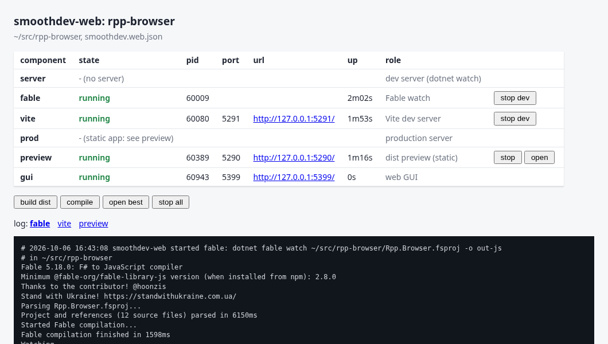

# smoothdev.web

A bird's-eye view of a **Vite + Fable + .NET** web app while you work on it: one command starts the dev
server under `dotnet watch --non-interactive`, Fable and Vite on free ports, builds the static bundle,
runs the published production server, shows the logs, opens the right URL, and stops everything again
with no process left behind. From the command line, a terminal UI, or a small web GUI it serves itself.

```
smoothdev-web dev start      # dotnet watch + Fable + Vite, ports picked free
smoothdev-web status         # what runs, PID, port, URL
smoothdev-web dist           # production bundle into dist/
smoothdev-web open dist      # serve dist/ like a static host would, open it
smoothdev-web stop           # stop all of it, process groups included
```

## Why

An F# web app usually has three or four long-running processes in development (the server under
`dotnet watch`, Fable, Vite, sometimes a proxy) and another shape in production (a published server
and a static bundle). Each app ends up with its own `concurrently` line, its own hard-coded ports
that collide with the app next door, and its own way of leaving a stray `dotnet` or `node` process
behind after Ctrl+C. smoothdev.web is that wiring done once:

- **ports are never a reason to fail**: the preferred port is probed and the next free one is used,
  then handed to the server (`ASPNETCORE_URLS`) and to Vite (`--port`, and the proxy target in an
  environment variable the vite config reads);
- **every component is its own process group**, recorded in a state file, so a second invocation (or
  another terminal, or the GUI) sees what runs and `stop` ends the whole tree, including the
  MSBuild nodes and esbuild workers it spawned;
- **one entry point per app** for dev, prod, static preview and bundle, scriptable (`status --json`)
  and with a UI when you want to watch.

## Install

smoothdev.web is a .NET tool (needs the .NET 10 SDK; runs on macOS and Linux).

```sh
# from a clone of this repository, in tools/smoothdev.web
dotnet fsi build.fsx -- install
smoothdev-web --help
```

`install` packs `artifacts/smoothdev.web.0.1.0.nupkg` and installs it as a global tool. Run it again
after a change: the same version is uninstalled and installed again, which is what `dotnet tool update`
will not do while the package version stays `0.1.0`. The source is this repository, not nuget.org.

Or run it from source without installing: `dotnet run --project src/SmoothDev.Web -- status`.

## Quick start

In the folder of a Vite app (or above it: see *detection* below):

```sh
smoothdev-web config show    # what it detected: client dir, Fable mode, server project, package manager
smoothdev-web config init    # write it to smoothdev.web.json, then adjust
smoothdev-web dev start
smoothdev-web open dev
smoothdev-web logs -f        # follow every running component's log
smoothdev-web dev stop
```

Sample session (a static F# app: Fable compiled outside Vite, npm, no server):

```
$ smoothdev-web dev start
installing Node packages with npm
$ npm ci --no-audit --no-fund
install | added 16 packages in 5s
$ dotnet tool restore
tools | Restore was successful.
started fable (pid 61721)
waiting for Fable's first compilation
started vite (pid 61777, port 5291)
vite ready: http://127.0.0.1:5291/

$ smoothdev-web dev start          # in another app whose preferred port is 5291 too
port 5291 is busy: Vite uses 5292
started vite (pid 61782, port 5292)
vite ready: http://127.0.0.1:5292/

$ smoothdev-web dist
dist | dist/index.html                 0.34 kB │ gzip:  0.25 kB
dist | dist/assets/index-BOFfZ5-O.js  74.03 kB │ gzip: 24.15 kB
dist ready: ~/src/rpp-browser/dist (4 files, 82 KiB)

$ smoothdev-web stop
stopped gui (pid 61952)
stopped preview (pid 61955)
stopped vite (pid 61777)
stopped fable (pid 61721)
```

## Commands

| command | what it does |
|---|---|
| `status [--json]` | every component: state, PID, port, URL, uptime |
| `dev start\|stop\|restart` | the server under `dotnet watch --non-interactive`, Fable watch (when Fable runs outside Vite), Vite |
| `prod start\|stop` | `dotnet publish -c Release`, then the published server (`Production`) serving `dist` |
| `preview start\|stop` | `dist` served as static files by the tool (what GitHub Pages, S3 or nginx would serve) |
| `build` | compile once to check: `dotnet build` of the server, Fable for the client |
| `dist` | the production bundle: Fable, then `vite build --outDir <dist>` |
| `open [dev\|dist\|prod]` | open that version in a browser; `dist` starts the preview if needed; no target: dev, else prod, else preview, else dist |
| `logs [name…] [-f] [-n N]` | last N lines of component logs (`server`, `fable`, `vite`, `prod`, `preview`, `gui`, `dist`, `build`, `publish`, `install`); `-f` follows |
| `stop` | stop everything this app runs |
| `tui` | terminal UI; on exit it prints the command line that started it, to re-run it |
| `gui [--port N] [--detach]` | web GUI on 127.0.0.1 (default port 5399); `--detach` runs it in the background |
| `config [show\|init]` | print the resolved config / write `smoothdev.web.json` from detection |

Global options: `--dir <app folder>` (default: the current folder; the nearest `smoothdev.web.json` at
or above it wins), `--no-browser` (print URLs instead; also `SMOOTHDEV_WEB_NO_BROWSER=1`).
Exit code 0 on success, 1 on failure, 2 on a usage error.

## Components

| name | started by | command | output |
|---|---|---|---|
| `server` | `dev start` | `dotnet watch --non-interactive --no-launch-profile --project <server>` | `.smoothdev/web/logs/server.log` |
| `fable` | `dev start` (Fable CLI mode) | `dotnet fable watch <project> -o <outDir>` | `fable.log` |
| `vite` | `dev start` | `<client>/node_modules/.bin/vite --port <p> --strictPort --host 127.0.0.1` | `vite.log` |
| `prod` | `prod start` | `dotnet <published>.dll` | `prod.log` |
| `preview` | `preview start`, `open dist` | `smoothdev-web __serve-static <dist> <base> <port>` | `preview.log` (one line per request) |
| `gui` | `gui --detach` | `smoothdev-web gui --port <p>` | `gui.log` |

`dev start` brings them up in order: Node packages installed if `node_modules` is missing (frozen to the
lockfile), `dotnet tool restore` when a tool manifest is found, the server, Fable (waiting for its first
compilation so Vite does not serve a 404 for the entry module), Vite, then it waits until each URL
answers HTTP. If a step fails, the log tail is printed and what that call started is stopped again.

## smoothdev.web.json

Optional: without it the tool detects the app (see below). With it, the folder holding the file is the
app root; relative paths resolve against it. Comments and trailing commas are allowed; unknown keys
are rejected (typos do not pass silently).

```jsonc
{
  "name": "shop",
  "packageManager": "pnpm",              // pnpm | npm | yarn | bun; default: from the lockfile
  "client": {
    "dir": "src/Client",                 // the Vite app (package.json + vite config)
    "fable": "plugin",                   // "plugin": vite-plugin-fable compiles inside Vite
                                         // { "project": "Client.fsproj", "outDir": "out", "extension": ".js" }:
                                         //   dotnet fable watch beside Vite ("cli" = detect the project)
                                         // "none": plain Vite
    "port": 5173,                        // preferred Vite port
    "dist": "dist",                      // bundle folder, relative to client.dir
    "base": "/shop/"                     // Vite base for the bundle; omitted: the vite config's own
  },
  "server": {
    "project": "src/Server/Server.fsproj",
    "port": 5000,                        // preferred dev port
    "prodPort": 8080,                    // preferred port of the published server
    "serveDist": true                    // prod: web root = client dist (default when there is a client)
  },
  "previewPort": 4173,
  "guiPort": 5399
}
```

A static app (no backend) simply has no `server`; `prod` then reports that the production form of the
app is its `dist`, and `open prod` opens the preview.

### Detection

When there is no `smoothdev.web.json` at or above the folder:

- **client**: the first of `.`, `src/Client`, `src/client`, `client`, `src/Web`, `web`, `frontend` that
  is a Vite app: a `vite.config.*`, or `package.json` / `package.yaml` / `packages.yaml` depending on
  `vite`. `pnpm-lock.yaml` next to a vite config counts even when there is no manifest;
- **Fable mode**: `plugin` when `package.json` or the vite config mention `vite-plugin-fable`; else
  `cli` with the client folder's `.fsproj`, the output folder read from the module `index.html`
  imports (`import … from "./out-js/App.js"` → `out-js`); else `none`;
- **server**: the shortest-path project with `Sdk="Microsoft.NET.Sdk.Web"` up to four folders down
  (`bin`, `obj`, `node_modules`, `dist`… skipped);
- **package manager**: the lockfile (`pnpm-lock.yaml`, `package-lock.json`, `yarn.lock`, `bun.lock`),
  else the `packageManager` field, else pnpm.

## The port and environment contract

Ports are picked at start: the preferred one if nothing listens on it (a TCP connect to 127.0.0.1 and
::1 must fail and a bind must succeed), else the next free one up to +100, else one the OS hands out.
Ports held by the app's other running components are never reused. Everything binds 127.0.0.1.

What each process receives:

| variable / argument | server (dev) | server (prod) | Vite |
|---|---|---|---|
| `ASPNETCORE_URLS=http://127.0.0.1:<port>` | ✓ | ✓ | |
| `ASPNETCORE_ENVIRONMENT` | `Development` | `Production` | |
| `PORT`, `SMOOTHDEV_WEB_SERVER_PORT` | ✓ | ✓ | `SMOOTHDEV_WEB_SERVER_PORT` when there is a server |
| `SMOOTHDEV_WEB_SERVER_URL` | ✓ | | ✓ when there is a server: **the proxy target** |
| `SMOOTHDEV_WEB_DIST`, `ASPNETCORE_WEBROOT` = client dist | | ✓ when `serveDist` | |
| `DOTNET_WATCH_RESTART_ON_RUDE_EDIT=1`, `…SUPPRESS_LAUNCH_BROWSER=1` | ✓ | | |
| `--no-launch-profile` (launchSettings.json would override the URL) | ✓ | | |
| `SMOOTHDEV_WEB_VITE_PORT`, `--port <p> --strictPort --host 127.0.0.1` | | | ✓ |

So a server only has to honour `ASPNETCORE_URLS` (ASP.NET Core, Giraffe and Saturn do by default; a
`UseUrls`/`Kestrel` call with a fixed port would defeat it), and a Vite config that proxies API calls
reads its target from the environment:

```js
// vite.config.js
import { defineConfig } from "vite";
import fable from "vite-plugin-fable";

const server = process.env.SMOOTHDEV_WEB_SERVER_URL ?? "http://127.0.0.1:5000";

export default defineConfig({
  plugins: [fable()],
  server: { proxy: { "/api": server } },
});
```

Vite gets `--strictPort` because the port was already checked: if something grabs it in between, Vite
fails loudly instead of silently moving to a port the tool does not know.

## Making an app smoothdev.web-enabled

1. Vite app with a `package.json` and a lockfile; Fable either through `vite-plugin-fable` or through
   the Fable dotnet tool (pinned in `.config/dotnet-tools.json`).
2. Server, if any: an ASP.NET Core project that takes its URL from `ASPNETCORE_URLS`; in production it
   serves static files from its web root (`app.UseStaticFiles()`; the tool points `ASPNETCORE_WEBROOT`
   at the client's `dist`).
3. The vite proxy target from `SMOOTHDEV_WEB_SERVER_URL` (above).
4. `smoothdev-web config init`, review, commit `smoothdev.web.json`; add `.smoothdev/` to `.gitignore`.

## Terminal UI and web GUI

`smoothdev-web tui` (keys: **d** dev on/off, **p** prod, **v** preview, **b** dist, **o** open,
**l** next log, **q** quit and stop what it started, **x** quit and leave things running):

```
smoothdev-web rpp-browser  ~/src/rpp-browser/smoothdev.web.json
╭───────────┬───────────────────────────┬───────┬──────┬────────────────────────┬───────┬───────────────────────╮
│ component │ state                     │ pid   │ port │ url                    │ up    │ role                  │
├───────────┼───────────────────────────┼───────┼──────┼────────────────────────┼───────┼───────────────────────┤
│ server    │ - no server               │       │      │                        │       │ dev server            │
│ fable     │ running                   │ 60009 │      │                        │ 2m06s │ Fable watch           │
│ vite      │ running                   │ 60080 │ 5291 │ http://127.0.0.1:5291/ │ 1m57s │ Vite dev server       │
│ prod      │ - static app: see preview │       │      │                        │       │ production server     │
│ preview   │ running                   │ 60389 │ 5290 │ http://127.0.0.1:5290/ │ 1m20s │ dist preview (static) │
╰───────────┴───────────────────────────┴───────┴──────┴────────────────────────┴───────┴───────────────────────╯
┌─log: fable (~/src/rpp-browser/.smoothdev/web/logs/fable.log)───────────────────────────────────────────────────┐
│ Project and references (12 source files) parsed in 6150ms                                                      │
│ Started Fable compilation...                                                                                   │
│ Fable compilation finished in 1598ms                                                                           │
│ Watching ..                                                                                                    │
└────────────────────────────────────────────────────────────────────────────────────────────────────────────────┘
d dev  p prod  v preview  b dist  o open  l next log  q quit (stops what it started)  x quit, leave running
```

`smoothdev-web gui` serves the same view as a page on 127.0.0.1 (server-rendered HTML with plain
forms and a 2-second refresh: nothing to build, no script). `GET /api/status` returns the status as JSON.



The TUI and the GUI stop what *they* started when they exit; components started from the command line
keep running until `stop`.

## Process tracking

- Each component is started with `posix_spawn` as the **leader of a new process group**, stdin from
  `/dev/null`, stdout and stderr appended to its log file, signal dispositions reset (so a child does
  not inherit an ignored `SIGPIPE`). It survives the terminal that started it, and Ctrl+C in that
  terminal does not reach it.
- `.smoothdev/web/state.json` in the app root records name, PID, group, port, URL, log, command,
  start time and owner. Writes are atomic under a lock file. Entries whose processes are gone are
  dropped on the next read; a recorded PID only counts if it still leads its recorded group (PID reuse).
- `stop` snapshots the process table, sends `SIGTERM` to the group and to every descendant (also those
  that moved to another group), waits up to 8 s, then `SIGKILL`s what is left. Zombies count as gone.
- A component whose leader exited while other members of its group still run shows as `orphaned`;
  `stop` ends them.

## Limitations and roadmap

Works today: everything above, on macOS (tested with a static Fable + Vite app: dev, second instance on
the next port, dist, preview, GUI actions, stop with nothing left running) and, by construction, Linux.

Not done yet:

- **Windows**: process groups are POSIX here; a Job Object based runner is the plan.
- **Server path not exercised end to end yet**: `dotnet watch` and `prod start` follow the contract
  above but were only tested on a static app so far; a sample client + server app in this repository
  is next.
- **Fable CLI + Vite proxy readiness**: `dev start` waits for Fable's first "Watching" line; there is no
  health URL setting for servers that answer `/` with an error until warmed up (any HTTP answer counts).
- **Logs**: plain files truncated at each start; no rotation, no merged timeline across components.
- **TUI**: no scrolling in the log pane; the GUI refreshes the whole page every 2 seconds.
- **Config**: JSON only (no TOML); no per-component extra arguments or environment yet.
- **Packaging**: not published to nuget.org yet. `dotnet fsi build.fsx -- install` packs and replaces the global tool from `artifacts/`.

## Development

```sh
dotnet fsi build.fsx -- check     # restore, build, tests
dotnet fsi build.fsx -- pack      # artifacts/smoothdev.web.<version>.nupkg
dotnet fsi build.fsx -- install   # pack, then replace the global tool
```

House style: F# with 2-space indentation (`.editorconfig`), formatted by hand (vertical alignment of
record fields and tabular code; no whole-file formatter), dependencies through paket (`paket.dependencies` at the
repository root, `paket.references` per project), Expecto tests, one-shot commands through CliWrap
(long-running components use `posix_spawn` because they need their own process group), build steps
in a Partas.Build `build.fsx`.

Layout: `src/SmoothDev.Web` (`Types` model, `Ports`, `Config`, `Posix`, `State`, `Runner`,
`StaticServer`, `Actions`, `Tui`, `Gui`, `Program`), `tests/SmoothDev.Web.Tests` (port picking,
config parsing and detection, process tracking, static file resolution).
